# Damus で始める

Damus (ダムス) は iOS 用の代表的な Nostr クライアントです。
ここでは、 Damus を使って Nostr を始める方法について解説します。

## インストールする {#install}

まずは App Store から Damus を見つけてインストールしましょう。

* <https://apps.apple.com/jp/app/damus/id1628663131>

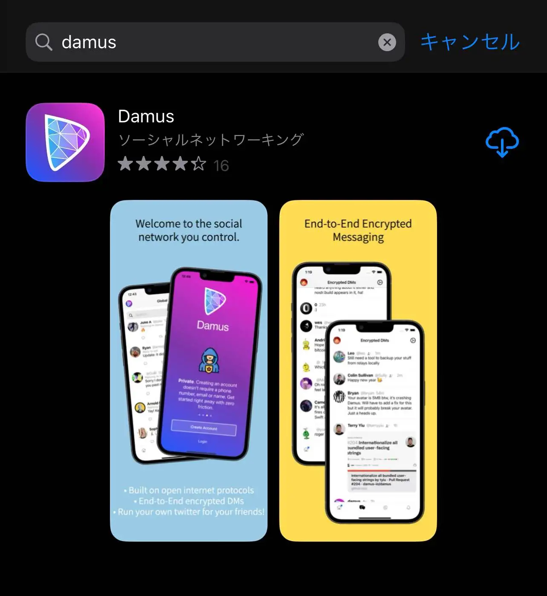

## アカウントを作成する {#create-account}

アプリを開いて、「始めよう！」をタップします。

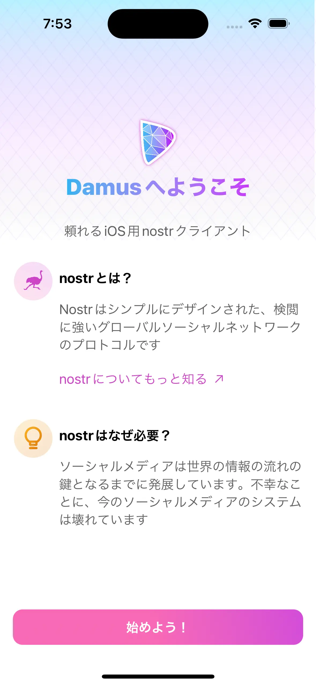

利用規約 (EULA) が出てくるので、規約に同意する場合は 「許可」 (または「同意する」) をタップしましょう。

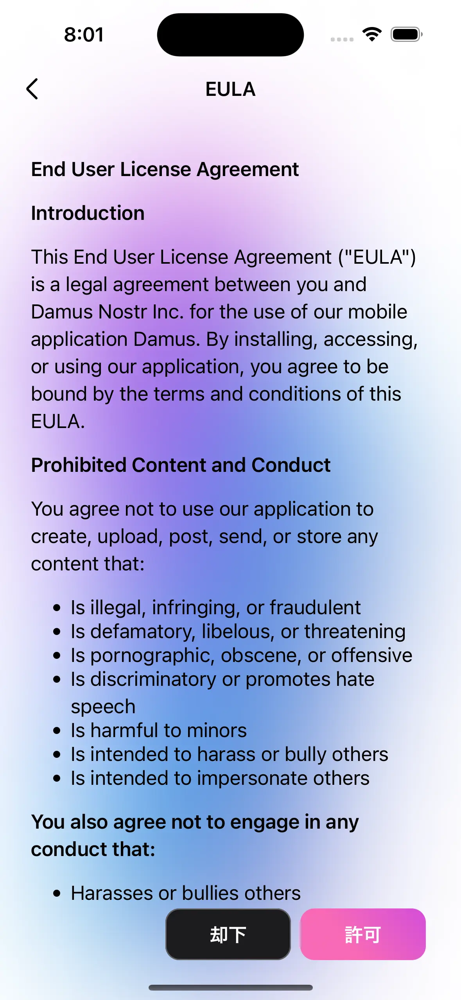

サインイン画面が表示されるので「アカウント作成」をタップします。

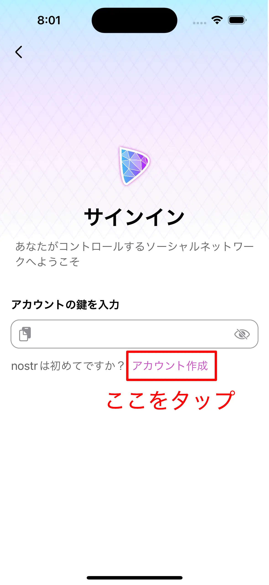

まず、あなたのプロフィールを登録します。入力が終わったら「今すぐアカウントを作成」ボタンをタップしてください。

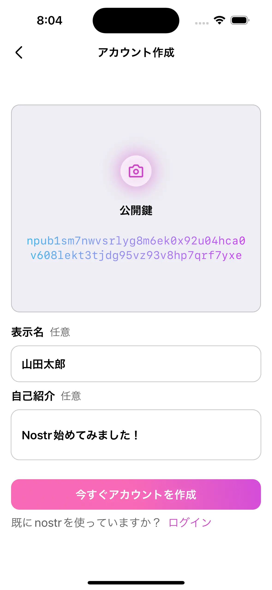

続く画面では、あなたの **公開鍵** と **秘密鍵** が確認できます。
公開鍵と秘密鍵についてここでは簡単な説明にとどめるので、詳しく知りたい方は [公開鍵・秘密鍵って何？](/guide/key-pair.html) を読んでみてください。

**公開鍵** はアカウント ID のようなもので、他の人に伝えるとこれでフォローしてもらえます。
コピーボタンをタップすると先に進むことができます。コピーした公開鍵をどこかに保存しておくと安心できますが、公開鍵は後からでも確認できるのでとりあえず先に進むとよいでしょう。

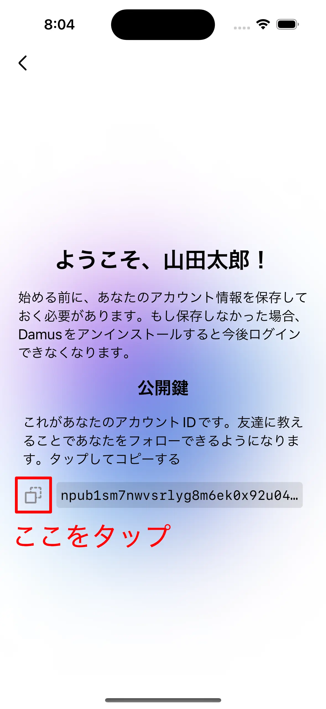

**秘密鍵** は、パスワードのようなもので **誰にも伝えてはいけません** 。
公開鍵と取り違えないように注意してください。`nsec` で始まるのが秘密鍵です。
公開鍵と同様に、こちらもコピーボタンをタップすると先に進みます。秘密鍵は忘れないように保存しておく必要がありますが、これも[後でコピーできる](#backup-nsec) ので、一旦後回しにしても先に進んでも大丈夫です。

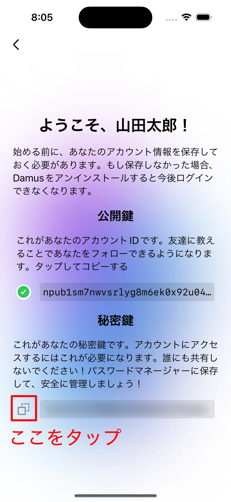

最後に「Let's go!」をタップすればアカウント作成は完了です。

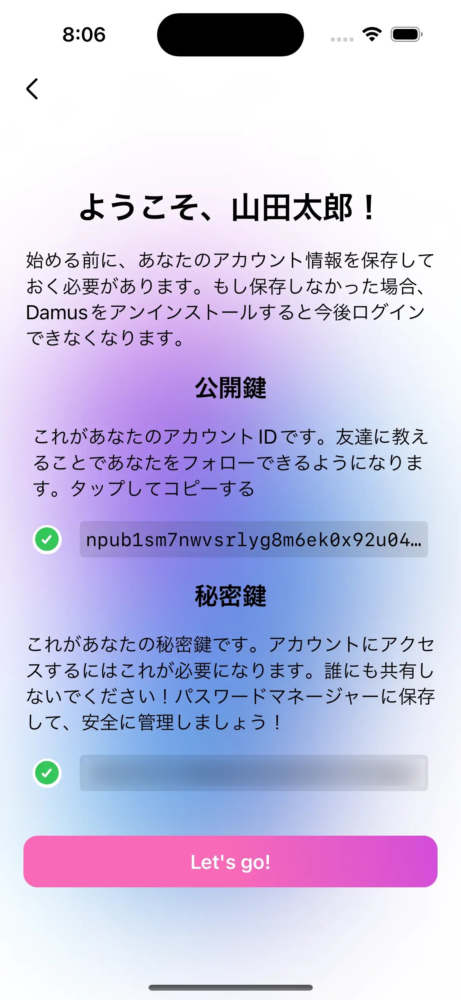

## リレーを設定する {#set-relays}

Nostr は分散型 SNS です。接続先のサーバー (**リレー** と言います) を自分で選ぶことができます。
リレーは最初からいくつか設定されていますが、適切に設定をリレー設定を変更すると、日本のユーザを見つけやすくなったり、自分をフォローしてもらいやすくなったりします。

リレーに関してもう少し詳しく知りたい方は [リレーって何？](/guide/relay.md) を読んでみると良いでしょう。

まず、左上のアイコンをタップしてメニューを開きます。

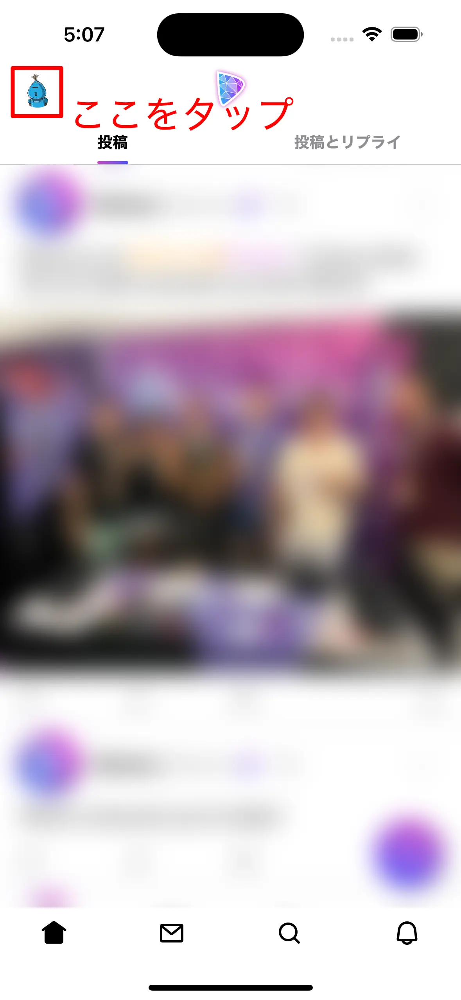

その中から「リレー」をタップします。

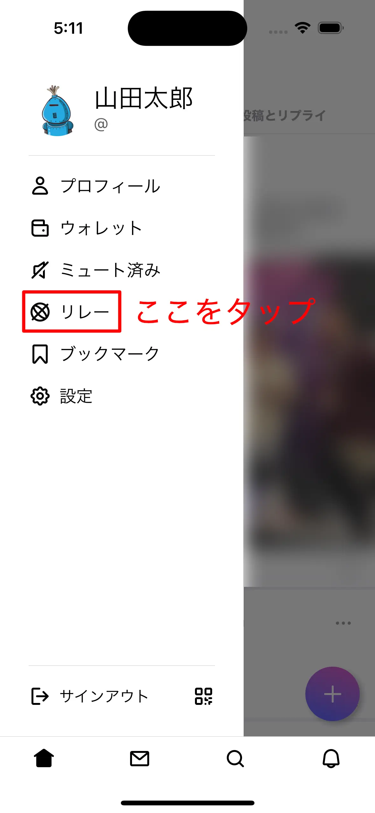

リレーの設定画面にやってきました。

下記のリストからいくつか URL を選んで入力してみましょう。
これらは日本に住んでいる Nostr ユーザがメインで利用しているリレーになります。

- `wss://nostr-relay.nokotaro.com`
- `wss://nostr.holybea.com`
- `wss://relay-jp.nostr.wirednet.jp`
- `wss://yabu.me`

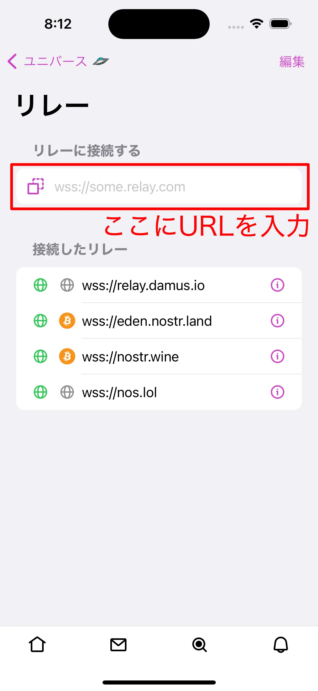

以下のように赤枠で囲んだ入力欄に入力して「追加」をタップしてください。

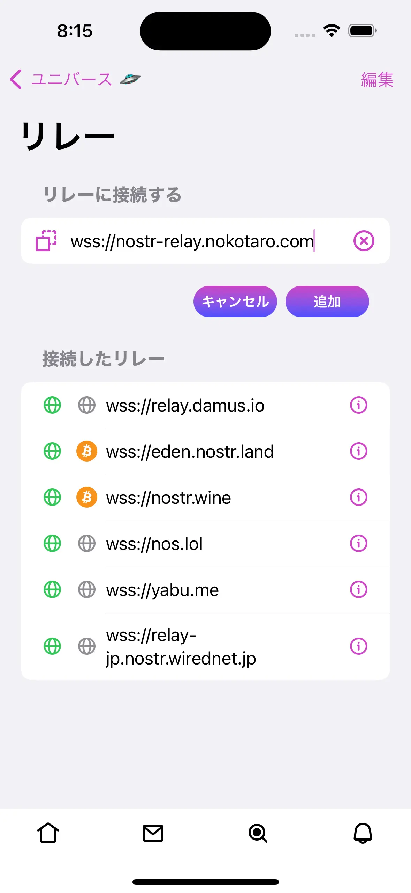

設定が完了したら、左上の「ホーム」で元の画面に戻ります。

## プロフィールを設定する {#set-profile}

名前や自己紹介は登録しましたが、詳細なプロフィールの設定はまだでした。
プロフィール画像などを設定して、フォローしてもらいやすくしましょう。

::: tip Hint
プロフィールの設定は [リレーの設定](#set-relays) のあとに行うのがおすすめです。
[ある種の不具合](/trouble-shooting.md#cannot-see-profile)の防止に繋がります。
:::

左上のアイコンをタップしてメニューを開き、「プロフィール」をタップします。

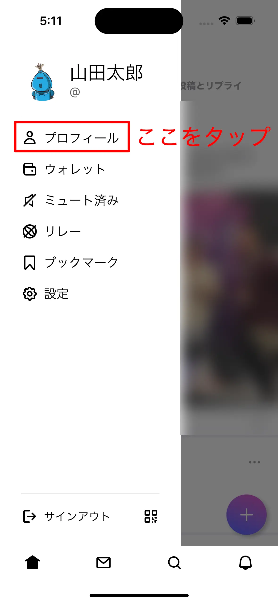

次に「編集」ボタンをタップします。

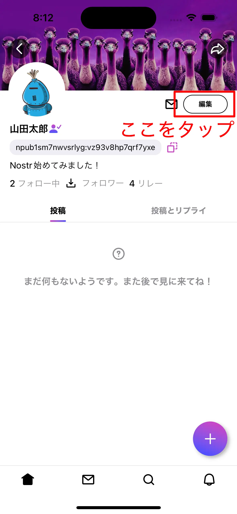

ここでプロフィール画像などの設定ができます。

- プロフィール画像: 左上のカメラ（📷）をタップすると、写真を選択してアップロードできます。
- バナー: プロフィール画面上部に表示される画像です。中央上部のカメラ（📷）をタップすると、写真を選択してアップロードできます。
- ユーザー名: 他のユーザからメンションされた場合に `@satoshi` のような形式で表示される名前です。

::: tip Hint
既存の多くの SNS とは異なり、 Nostr では ユーザー名の重複が許容されており、また後から自由に変更することもできます。
他のユーザに ID を取られる心配はないので、好きなように設定しましょう。
:::

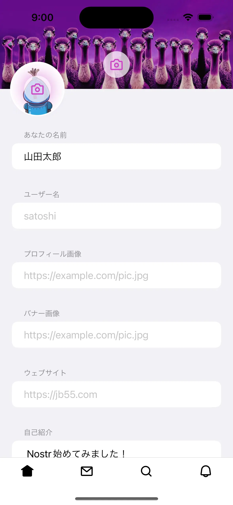

設定が終わったら、一番下にスクロールして「保存」ボタンをタップしましょう。

## タイムラインを眺めてみる {#see-timeline}

まだ誰もフォローしていなければ、「ユニバース」を眺めてみるとフォローする人を見つけられるかもしれません。
ユニバースタイムラインでは、リレーに投稿された最近の投稿を見ることができます。

ユニバースタイムラインを開くには、画面下端の虫眼鏡アイコンをタップします。

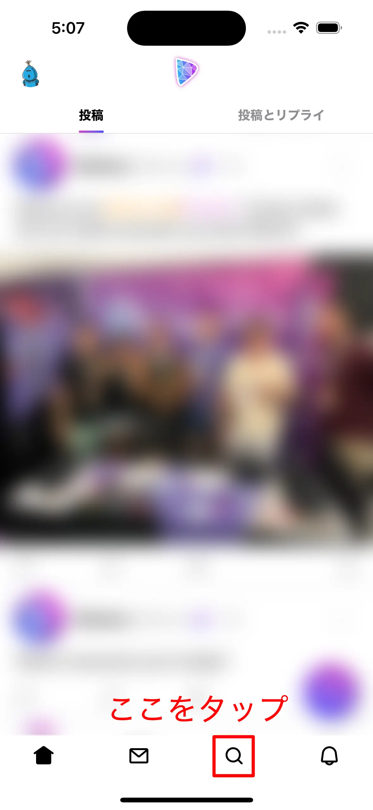

これがユニバースタイムラインです。
英語の投稿が多いでしょうが、日本のリレーを設定しているので日本語の投稿も見つけられるでしょう。
気になったユーザがいたらアイコンをクリックして、ユーザのページからフォローしてみましょう。

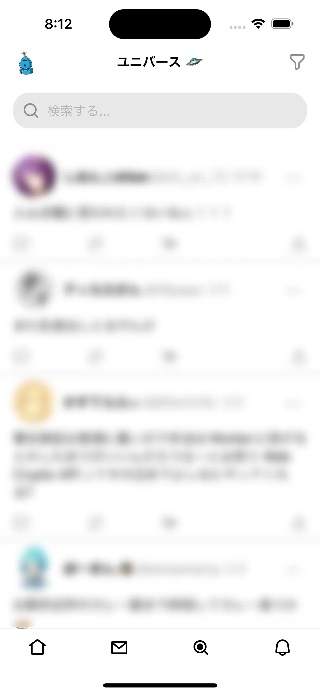

ユーザの探し方に関しては [タイムラインを作ろう](/tutorial/make-your-timeline.md) も合わせて読んでみてください。

## 投稿する {#create-note}

ホームタイムラインに戻って、右下のプラスボタン⊕から投稿できます。
Nostr には文字数制限がありませんので、好きなように投稿してみましょう。

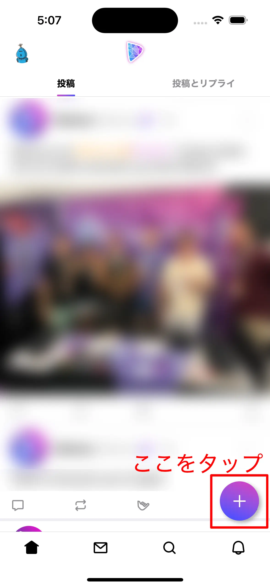

## 次のアクション {#next-action}

本サイトのチュートリアルを参考に、色々試してみると良いでしょう。

- 認証マークが欲しい → [認証マーク？をつけてみよう](/tutorial/nip-05.md)
- パソコンでも見たい、他のクライアントも試したい → [お気に入りのクライアントを探そう](/tutorial/explore-client.md)

## おまけ 1: 秘密鍵を保管する{#backup-nsec}

アカウント作成時にコピーした秘密鍵をどこにも保存しなかった場合でも、以下の手順で再度コピーできます。

1. メニューで「設定」をタップ

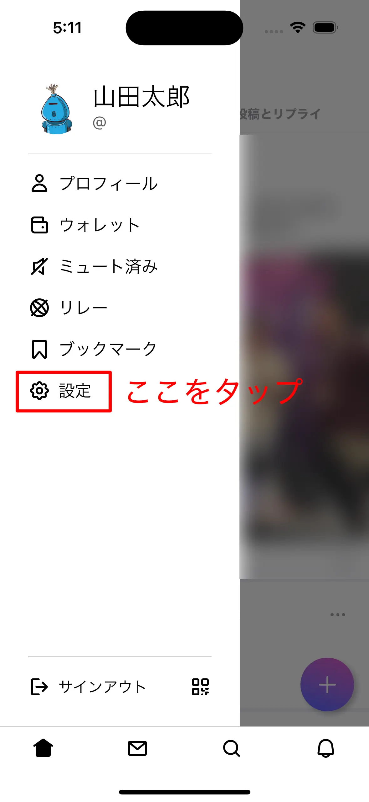

2. 「鍵」をタップ

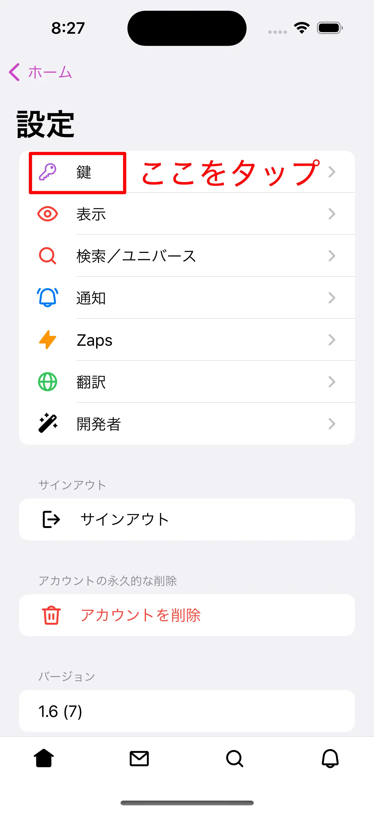

3. 「ログイン用秘密鍵」のコピーボタンをタップ

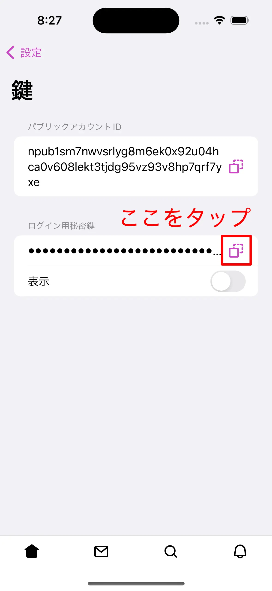

コピーした秘密鍵は忘れないように適切な場所に保管しておきましょう。適切な保管方法がわからない方は [おまけ: 秘密鍵を安全に保管する](#secure-storage-for-nsec) を参考にしてみてください。

## おまけ 2: 秘密鍵を安全に保管する {#secure-storage-for-nsec}

ここでは、 iOS の機能を使った秘密鍵の保管方法を 2 つ紹介します。

### メモアプリのロック機能を使う {#use-memo-app}

iOS に最初からインストールされている「メモ」アプリを利用する方法です。
ロック機能を利用することで、秘密鍵を暗号化して保管することができます。
ロック機能については [iPhone や iPad でメモをロックする／ロック解除する方法](https://support.apple.com/ja-jp/HT205794) を参照してください。

1. 「メモ」アプリを開き、新しいメモを追加
2. タイトルに「Nostr 秘密鍵」と記入し、本文にコピーした秘密鍵をペースト
3. 画面右上の詳細ボタン (…) を開いて「ロック」をタップ

### パスワード機能を使う {#use-password}

主に Web サービスのパスワードの保管に使われる「パスワード」機能を秘密鍵の保管に応用する方法です。
パスワード機能の利用方法については [日経クロステック - iPhoneの「パスワード」機能でパスワードを簡単・安全に管理しよう](https://xtech.nikkei.com/atcl/nxt/column/18/00088/00135/) を参照してください。

「Web サイト」欄は `nostr.keypair` にしておきましょう（`.` を付けないと保存できないため）。

## おまけ 3: 他の Nostr クライアントとの違い {#feature-comparison}

どの Nostr クライアントにも言えることですが、開発者の方針や好みによってサポートしている機能が異なります。
下記は Damus と他のクライアントとの主な違いをピックアップしたものです。

* Damus には投稿の削除機能がありません
* Damus にはキーワード検索機能がなく、ハッシュタグ検索のみサポートしています
* Damus には投稿に対する投げ銭機能 (ZAP) がなく、ユーザに対する直接の投げ銭のみサポートしています
* Damus にはコンテントワーニング機能がないため、センシティブな投稿が警告なしに表示される場合があります
* Damus にはカスタム絵文字機能がありません

使いたい機能がなかったり合わないと感じる場合には、他のクライアントも試してみるとよいでしょう。
[お気に入りのクライアントを探そう](/tutorial/explore-client.md) のページが参考になるかもしれません。
