# nostter で始める

nostter (ノスッター) は PC/iOS/Androidで使用できる代表的な Web版 Nostr クライアントです。
ここでは、 nostter を使って Nostr を始める方法について解説します。

## インストールする {#install}

まずは お好きなブラウザでnostterにアクセスしましょう。

* <https://nostter.app/>

nostterはPWAですので、PC・スマホアプリのようにインストールして使用することもできます。
インストールの手順は [PWAをインストールしよう](../tutorial/pwa-install.md) を参照してください。

## タイムラインを覗いてみる  {#view-timeline}

nostterでは、アカウントを作る前に、どのような投稿が行われているのか覗くことができます。

[「タイムラインをのぞいてみる」](https://nostter.app/trend)をタップして、覗いてみましょう。

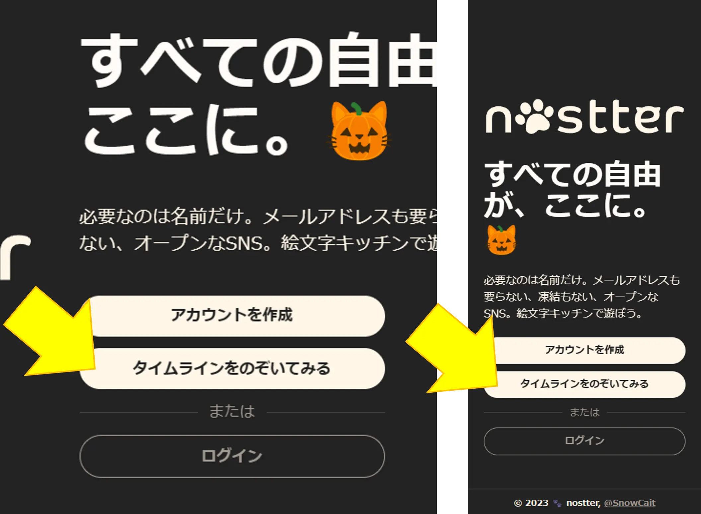

PCやタブレットでは、左のログインボタン、スマートフォンでは右下のボタンからログイン画面に戻ることができます。

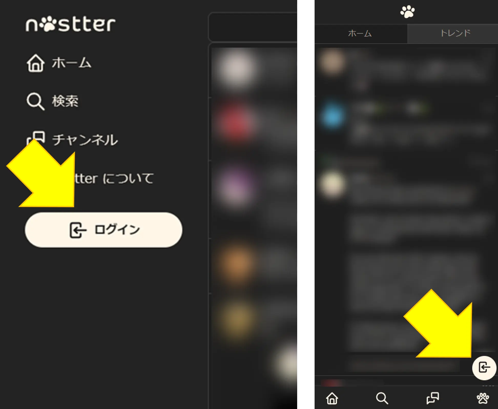

## アカウントを作成する {#create-account}

[トップページ](https://nostter.app/)を開いて、「アカウントを作成」をタップします。

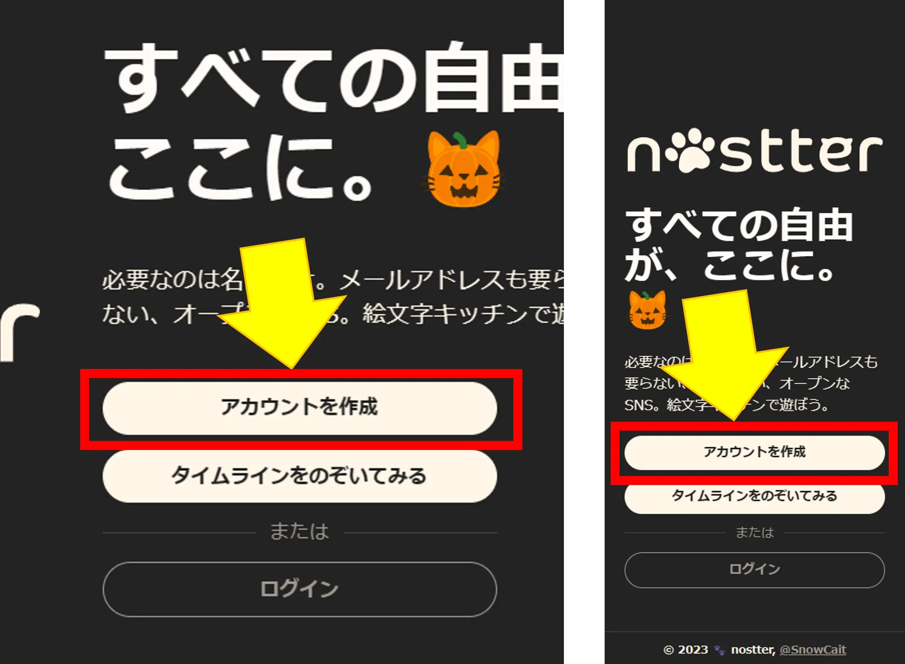

名前欄にハンドルネームを入力して、「作成」をタップしましょう。

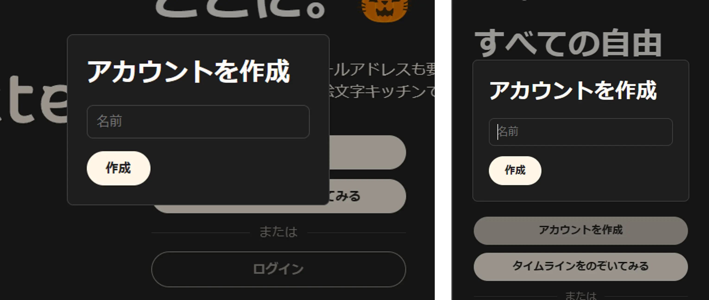

これでアカウントの作成は完了です。

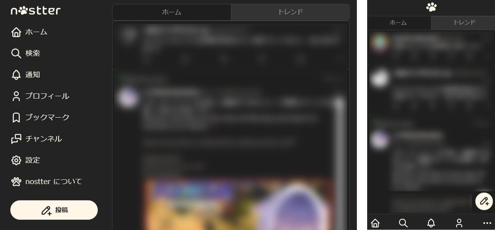

なお、このままNostrの世界をお楽しみいただけますが、このままだと何らかの理由でアクセスできなくなった際に、戻ってくることができなくなってしまいます。
(例えば、端末のアップデートの失敗、ブラウザキャッシュの消去、端末の紛失など)

そのため、自動生成されたパスワードに相当する**秘密鍵** は必ずバックアップしましょう。
公開鍵と秘密鍵についてここでは簡単な説明にとどめるので、詳しく知りたい方は [公開鍵・秘密鍵って何？](/guide/key-pair.html) を読んでみてください。

**公開鍵** はアカウント ID のようなもので、他の人に伝えるとこれでフォローしてもらえます。
Nostterではプロフィール画面からいつでも確認することができます。

**秘密鍵** は、パスワードのようなもので **誰にも伝えてはいけません** 。
公開鍵と取り違えないように注意してください。`nsec` で始まるのが秘密鍵です。

設定(⚙)をタップし、一番下のShowをタップすると表示されるものが秘密鍵です。

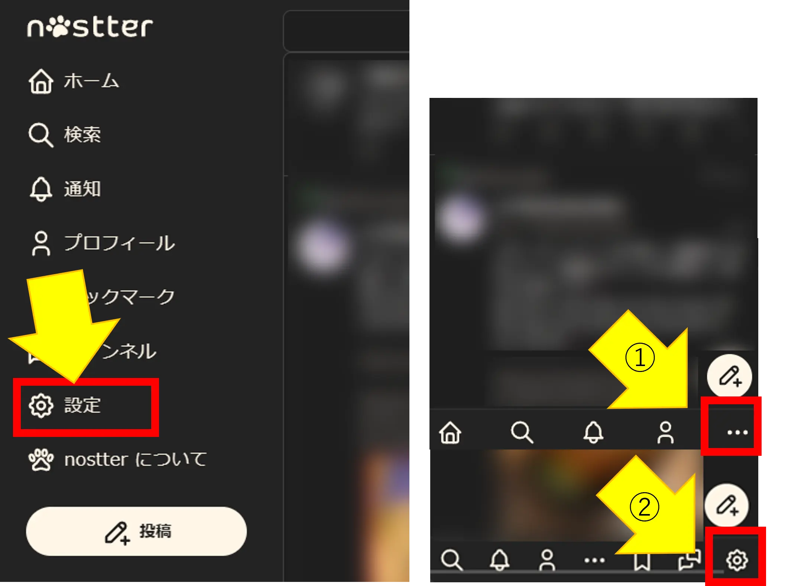

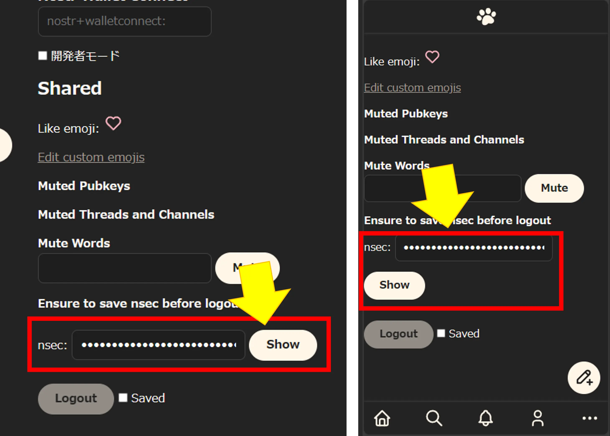

コピーして、秘密鍵は忘れないように適切な場所に保管しておきましょう。適切な保管方法がわからない方は [おまけ: 秘密鍵を安全に保管する](#secure-storage-for-nsec) を参考にしてみてください。

## タイムラインを眺めてみる {#see-timeline}

まだ誰もフォローしていなければ、「トレンド」を眺めてみるとフォローする人を見つけられるかもしれません。
(nostterでは、誰もフォローしていない状態では自動でトレンドタイムラインに切り替わります。)

トレンドタイムラインでは、接続先のサーバー (**リレー** と言います) に投稿された最近の投稿を見ることができます。

トレンドタイムラインを開くには、画面上端の「トレンド」をタップします。

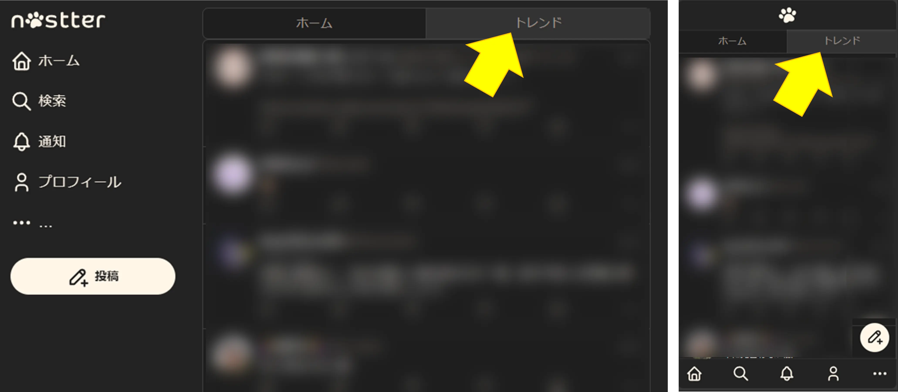

これがトレンドタイムラインです。
気になったユーザがいたらアイコンをクリックして、ユーザのページからフォローしてみましょう。

ユーザの探し方に関しては [タイムラインを作ろう](/tutorial/make-your-timeline.md) も合わせて読んでみてください。

逆に、フォローしている人だけを表示したい場合は、「トレンド」の隣の「ホーム」をタップしてください。

## 投稿する {#create-note}

PCであれば右側の投稿ボタン、スマートフォンであれば右下の投稿✏ボタンから投稿できます。
Nostr には文字数制限がありませんので、好きなように投稿してみましょう。

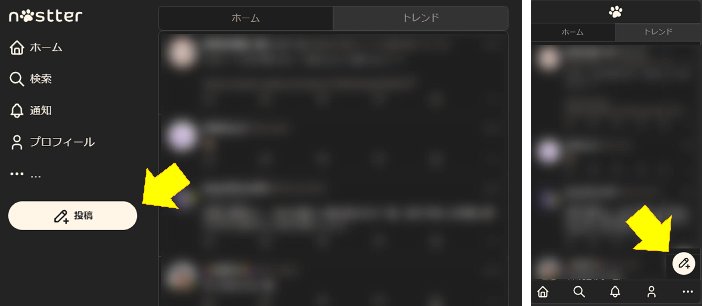

## プロフィールを設定する {#set-profile}

名前は登録しましたが、詳細なプロフィールの設定はまだでした。
プロフィール画像などを設定して、フォローしてもらいやすくしましょう。

::: tip Hint
プロフィールの設定は [リレーの設定](#set-relays) をしたあとには再度行ってください。(これは他のクライアントを利用するときでも同様です。)
[ある種の不具合](/trouble-shooting.md#cannot-see-profile)の防止に繋がります。
:::

PCやタブレットでは、左の「プロフィール」ボタン、スマートフォンでは右下のボタンから人型のアイコンをタップして自分のプロフィール画面を開きます。

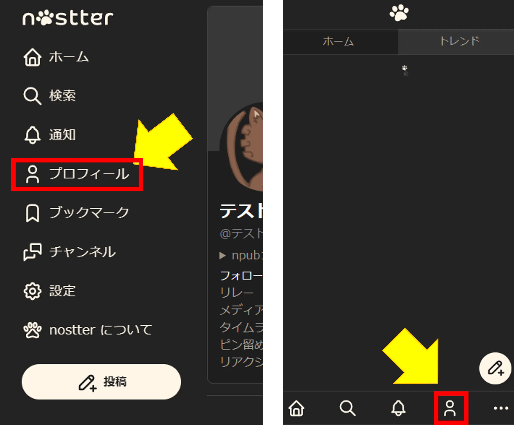

次に「編集🔧」ボタンをタップします。

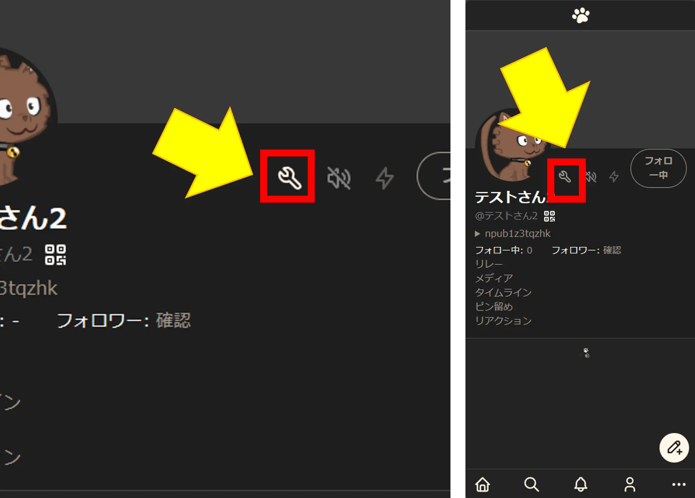

ここでプロフィール画像などの設定ができます。

- プロフィール画像: 右上の画像マークをタップすると、写真を選択してアップロードできます。
- バナー: プロフィール画面上部に表示される画像です。中央上部の画像マークをタップすると、写真を選択してアップロードできます。
- @name: 他のユーザからメンションされた場合に `@satoshi` のような形式で表示される名前です。

::: tip Hint
既存の多くの SNS とは異なり、 Nostr では ユーザー名の重複が許容されており、また後から自由に変更することもできます。
他のユーザに ID を取られる心配はないので、好きなように設定しましょう。
:::

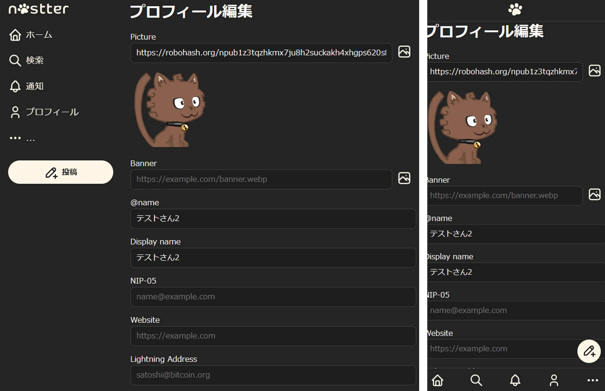

設定が終わったら、一番下にスクロールして「Save」ボタンをタップしましょう。

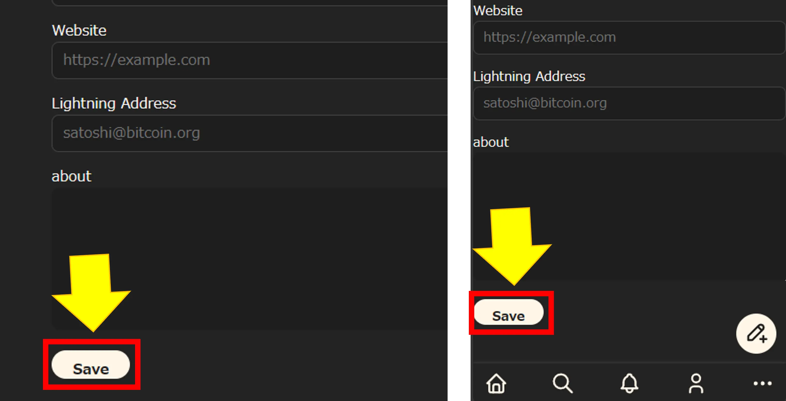

## 次のアクション {#next-action}

本サイトのチュートリアルを参考に、色々試してみると良いでしょう。

- 認証マークが欲しい → [認証マーク？をつけてみよう](/tutorial/nip-05.md)
- パソコンでも見たい、他のクライアントも試したい → [お気に入りのクライアントを探そう](/tutorial/explore-client.md)

## おまけ 1 秘密鍵を安全に保管する {#secure-storage-for-nsec}

ここでは、 iOS の機能を使った秘密鍵の保管方法を 2 つ紹介します。

### メモアプリのロック機能を使う {#use-memo-app}

iOS に最初からインストールされている「メモ」アプリを利用する方法です。
ロック機能を利用することで、秘密鍵を暗号化して保管することができます。
ロック機能については [iPhone や iPad でメモをロックする／ロック解除する方法](https://support.apple.com/ja-jp/HT205794) を参照してください。

1. 「メモ」アプリを開き、新しいメモを追加
2. タイトルに「Nostr 秘密鍵」と記入し、本文にコピーした秘密鍵をペースト
3. 画面右上の詳細ボタン (…) を開いて「ロック」をタップ

### パスワード機能を使う {#use-password}

主に Web サービスのパスワードの保管に使われる「パスワード」機能を秘密鍵の保管に応用する方法です。
パスワード機能の利用方法については [日経クロステック - iPhoneの「パスワード」機能でパスワードを簡単・安全に管理しよう](https://xtech.nikkei.com/atcl/nxt/column/18/00088/00135/) を参照してください。

「Web サイト」欄は `nostr.keypair` にしておきましょう（`.` を付けないと保存できないため）。

## おまけ 2: 他の Nostr クライアントとの違い {#feature-comparison}

どの Nostr クライアントにも言えることですが、開発者の方針や好みによってサポートしている機能が異なります。
下記は nostter と他のクライアントとの主な違いをピックアップしたものです。

* nostter には投稿の削除機能がありません

使いたい機能がなかったり合わないと感じる場合には、他のクライアントも試してみるとよいでしょう。
[お気に入りのクライアントを探そう](/tutorial/explore-client.md) のページが参考になるかもしれません。

## おまけ 3: リレーを設定する {#set-relays}

Nostr は分散型 SNS です。接続先のサーバー (**リレー** と言います) を自分で選ぶことができます。  
nostterでは、日本語コミュニティと交流するためのリレーは予めセットされています。そのためこの章の設定をする必要はありません。  

ですが一方で、今後新しいリレーが登場したり、話題別のリレーが登場するかもしれません。  
その際には、リレー設定を変更すると、特定の話題のユーザを見つけやすくなったり、自分をフォローしてもらいやすくなったりします。

リレーに関してもう少し詳しく知りたい方は [リレーって何？](/guide/relay.md) を読んでみると良いでしょう。

PCやタブレットでは、左の「プロフィール」ボタン、スマートフォンでは右下のボタンから人型のアイコンをタップして自分のプロフィール画面を開きます。

その中から「リレー」をタップします。

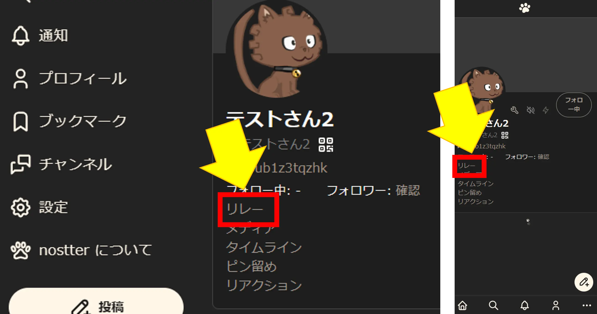

リレーの設定画面にやってきました。

nostterは日本産なため、すでに日本の主要なリレーは登録されている状態になっています。

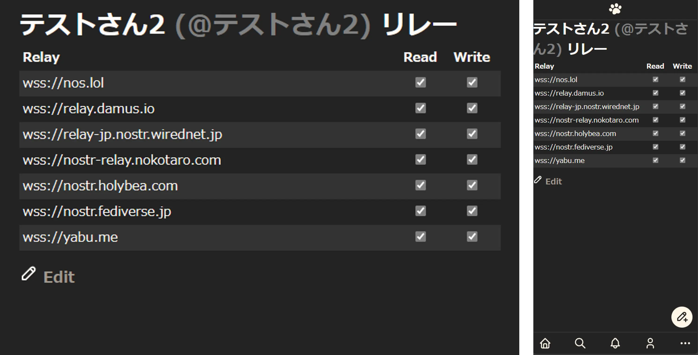

追加する場合は、「Edit」をタップ後、以下のように赤枠で囲んだ入力欄に入力して「Add」をタップしてください。

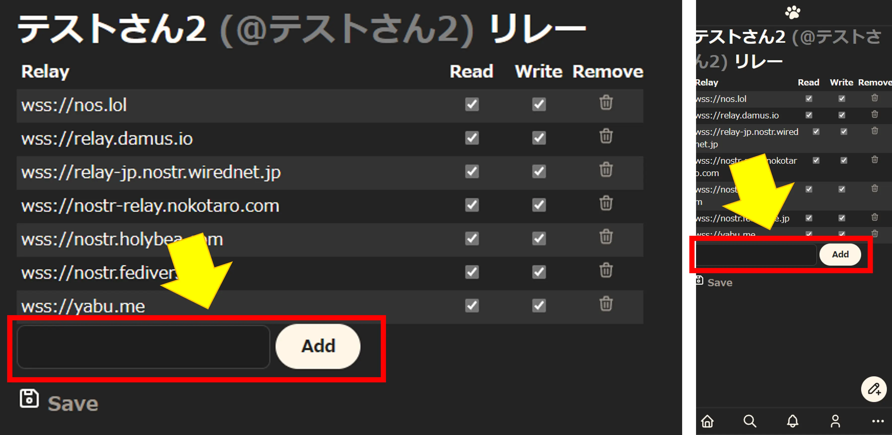

設定が完了したら、「Save」をタップして保存し、左上の「ホーム」で元の画面に戻ります。

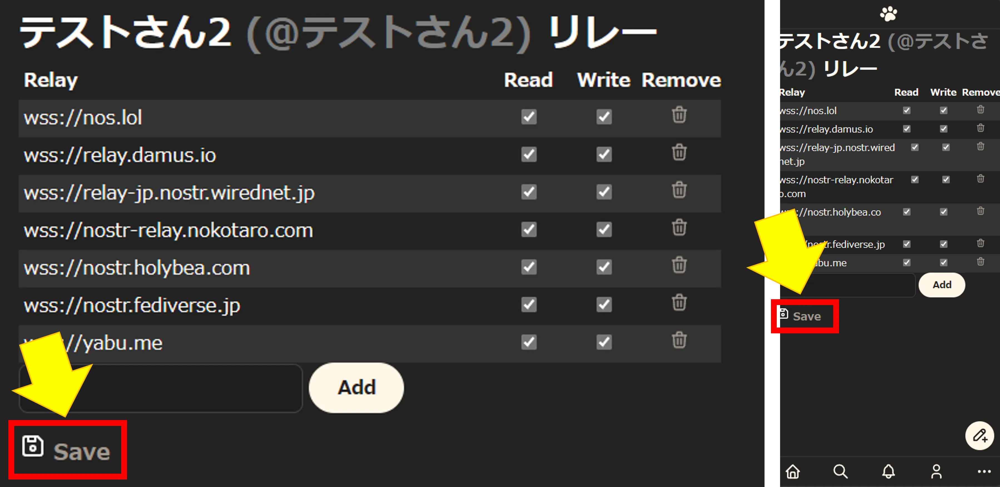

::: tip Hint
Read: チェックを外すと読み込みの対象から外すことができます。(Spamが多いリレーなど)
Write: チェックを外すと書き込みの対象から外すことができます。(書き込み有料リレーなど)
:::

