# NIP-07 (ブラウザ拡張機能) を使ってみよう

NIP-07は、アプリに直接秘密鍵を入れる代わりに、秘密鍵の保存と取り扱いをブラウザ拡張機能に集約することで、多種多様なクライアントアプリを安全に使えるようにする仕組みです。

アプリによっては、「秘密鍵を管理したくない」という理由で、この拡張機能がないと利用できないこともあります。

ここでは、主にPC/Android向けと、iOS(iPhone/iPad)向けの2種類の導入手順について説明します。

## nos2x/nos2x-fox (PC/Android)

### 導入手順

+ Edge/Chrome/Kiwi Browserの場合: [nos2x](https://chromewebstore.google.com/detail/nos2x/kpgefcfmnafjgpblomihpgmejjdanjjp)
+ Firefoxの場合: [nos2x-fox](https://addons.mozilla.org/ja/firefox/addon/nos2x-fox/)

を開き、「インストール」ボタンをクリックします。  
以降の手順は、Microsoft Edgeを使用した場合を例示します。

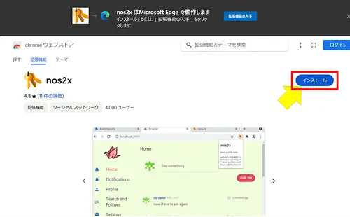

これが出た場合は「許可」をクリックします。

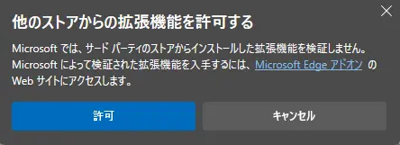

「拡張機能の追加」をクリックします。

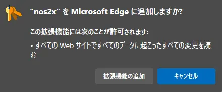

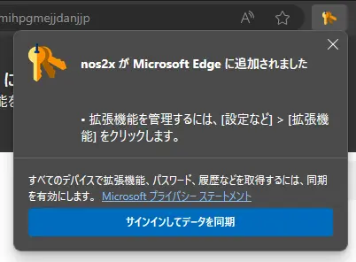

正常にインストールされたら、拡張機能ボタン(パズルのピースのマーク)をクリックします。
nos2xの横の「・・・」をクリックし、「拡張機能のオプション」

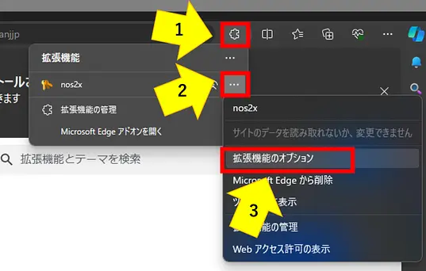

**すでに秘密鍵を持っている人は、「private key:」の欄に入力してください。**  
※もし今から新しいアカウントが欲しい場合は、「generate」ボタンをクリックします。

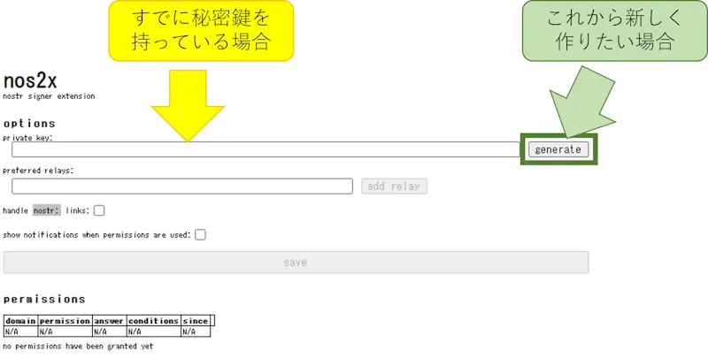

秘密鍵を入力、または新規作成したあと、「Save」ボタンがクリックできるようになります。  
必ずクリックしてください。

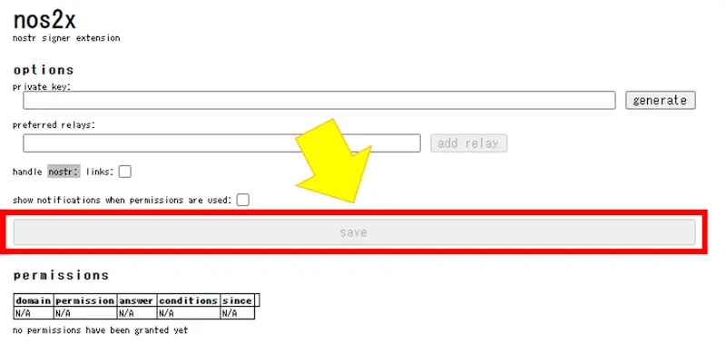

これで登録作業は完了です。

### 使い方

#### ログイン(公開鍵読み込み)時

例えば[Rabbit](https://syusui-s.github.io/rabbit/)を開くとこのような表示が出ます。

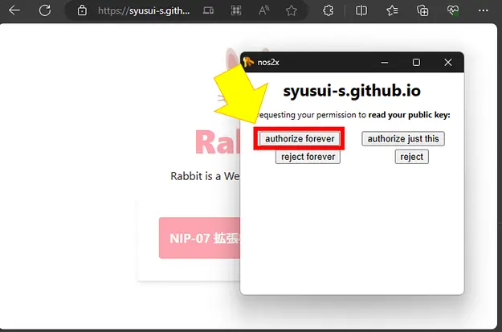

「ログイン(公開鍵の読み込み)に秘密鍵を使ってよいか？」という通知で、

+ authorize forever (常に許可)
+ authorize just this (今回だけ許可)
+ reject forever (常に拒否)
+ reject (今回だけ拒否)

から選択します。

基本的に「authorize forever」(常に許可)で大丈夫です。

#### 投稿(署名)時

何かを投稿したりリアクションしようとしたときにも、以下のような表示が出ます。

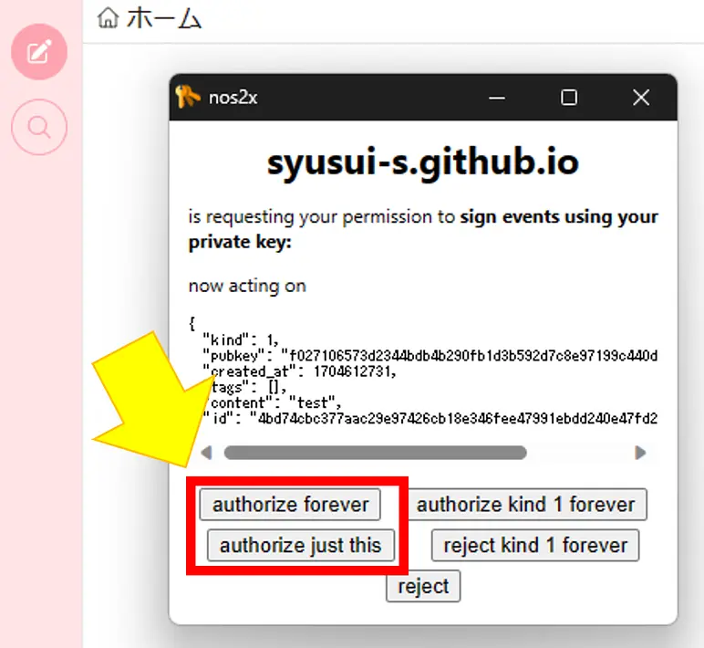

こちらは「あなたのアカウントで投稿(署名)してよいか？」という通知なので、

+ authorize forever (常に許可)
+ authorize kind 1 forever (短文投稿(kind 1)のみ常に許可)
+ authorize just this (今回だけ許可)
+ reject kind 1 forever (短文投稿(kind 1)のみ常に許可)
+ reject (今回だけ拒否)

から選択します。

基本的に「authorize forever」(常に許可)または、「authorize just this」(今回だけ許可)を選択します。

使い方は以上です。

## Nostore (iOS)

### 導入手順

[ここのアプリストアリンク](https://apps.apple.com/jp/app/nostore/id1666553677)または、App Storeを開いて「Nostore」で検索してください。

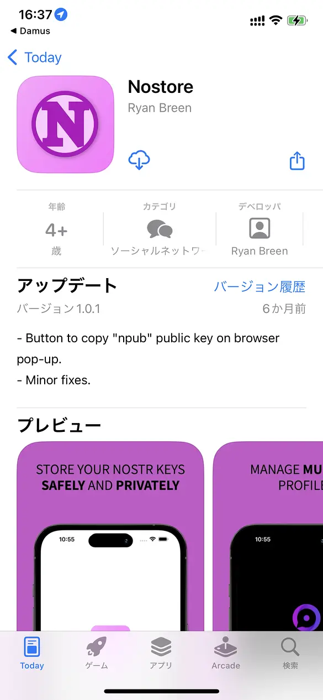

インストールが終わったら、「設定」アプリを開きます。

設定アプリ内の「Safari」をタップします。

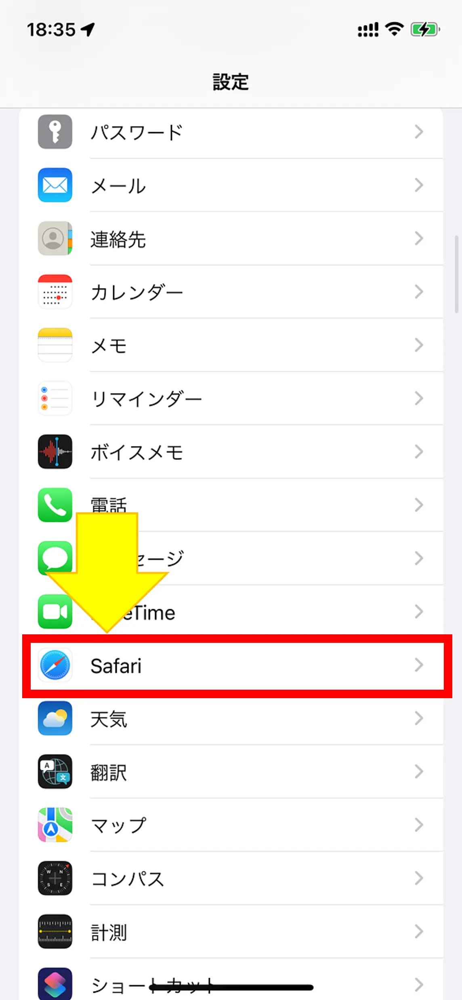

「機能拡張」をタップします。

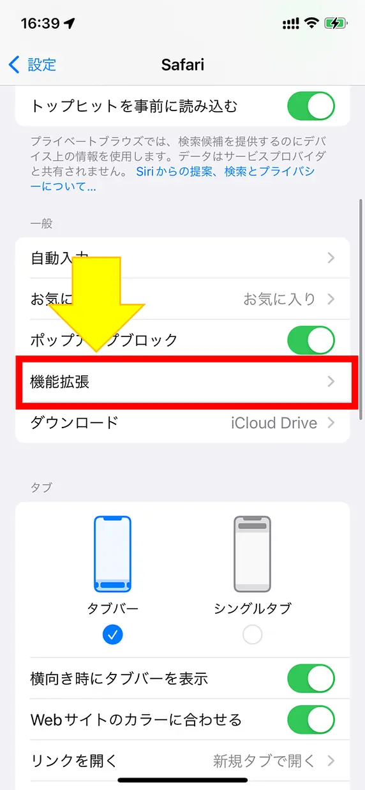

「Nostore」をタップします。

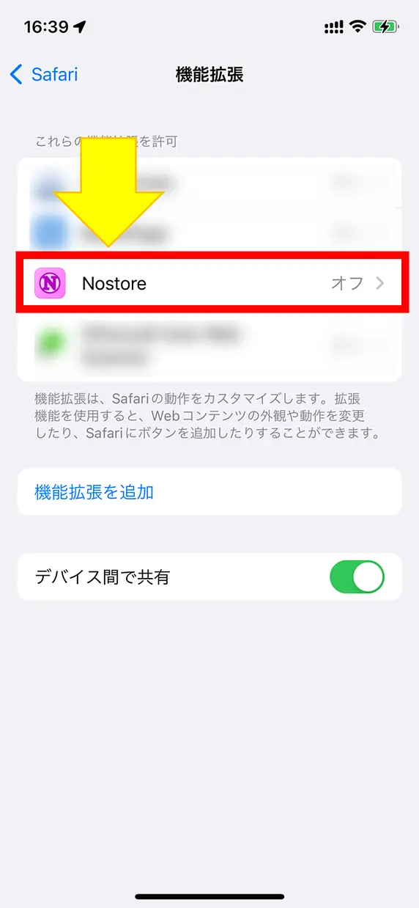

「機能拡張を許可」をタップします。

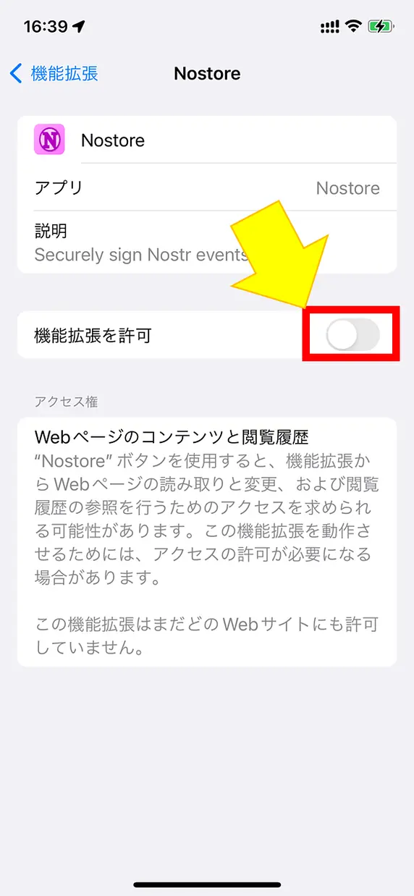

これで有効化されました。

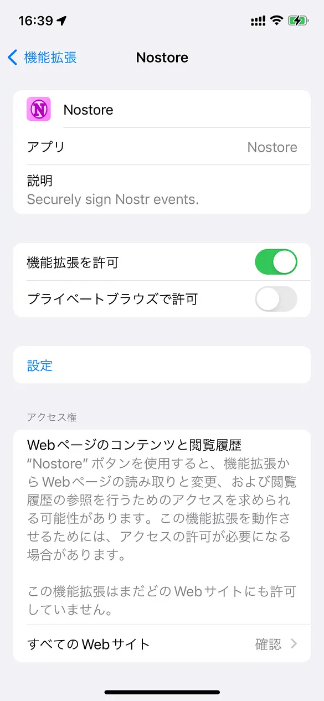

秘密鍵の設定は、利用時に行います。

### 使い方

#### ログイン(公開鍵読み込み)時

例えば[Rabbit](https://syusui-s.github.io/rabbit/)を開くとこのような表示が出ます。
ブラウザのコンテキストメニュー「ぁあ」をタップします。

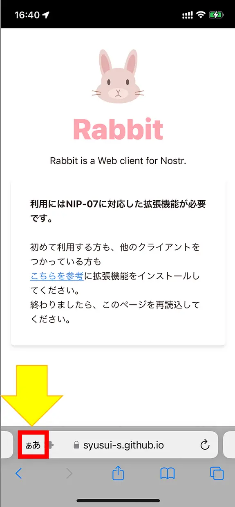

「Nostore」をタップします。

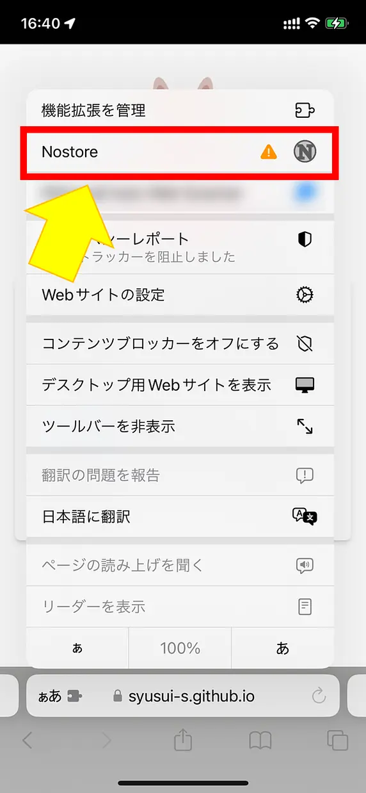

確認メッセージが出ますので、好きな方を選択します。
おすすめは、「常に許可...」です。

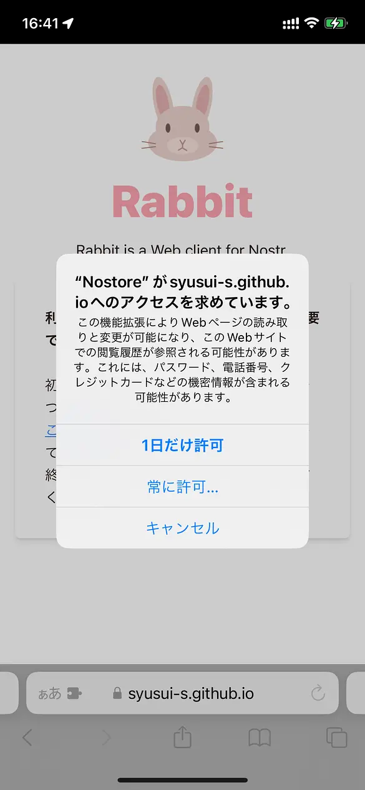

「常に許可...」を選択した場合、さらに確認メッセージが出ますので、好きな方を選択します。  
おすすめは、「このWebサイトで常に許可」です。

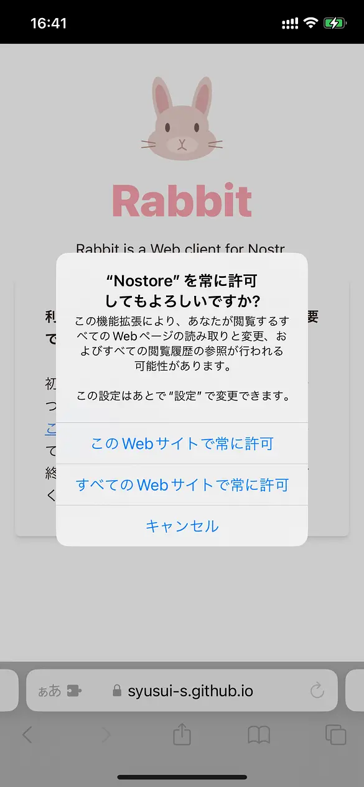

ここまでの操作は、(選択肢によりますが)nostrを使いたいサイト1つごとに設定が必要です。

**初回利用時は、続いてアカウント(秘密鍵)の設定に入ります。**

Nostoreの設定画面が出るので「Settings」をタップします。

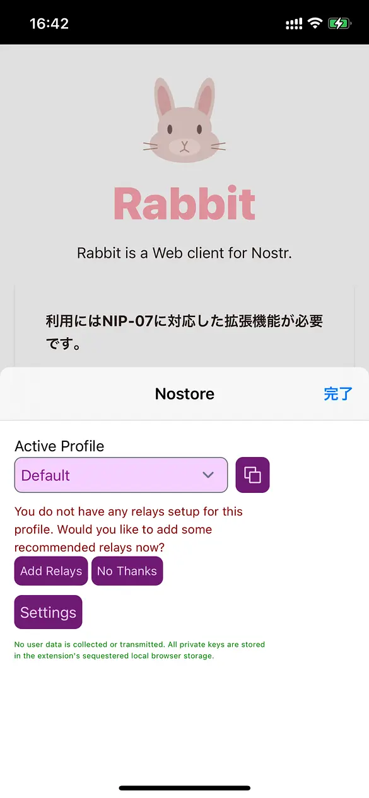

新しいタブが開き、詳細設定画面になります。

**すでに秘密鍵を持っている人は、「Private Key:」の欄を消して自分の鍵を入力してください。**  
※もし今から新しいアカウントが欲しい場合は、何もせずそのままタブを閉じます。

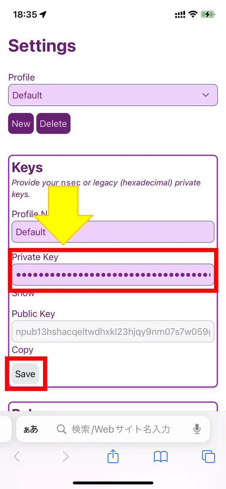

秘密鍵を入力したあとは、「Save」ボタンがクリックできるようになります。  
必ずタップしてください。

**ここまでが初回設定完了です**

タブを閉じるか戻ってください。

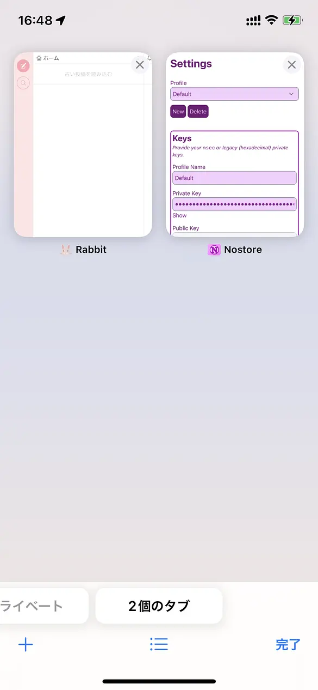

Webサイトの画面に戻ると

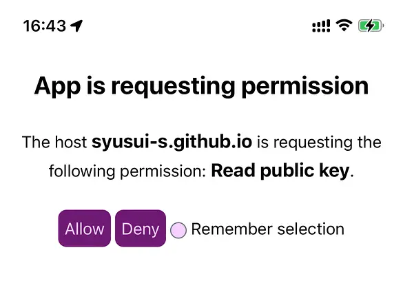

このような画面が出ます。(出ない場合は、サイトを開き直してください)。

「ログイン(公開鍵の読み込み)に秘密鍵を使ってよいか？」という通知で、
基本的に「Remember selection」(この選択を毎回使用する)をタップしてチェックを付けてから、「Allow」(許可)を選択します。

(チェックを付けない場合、何度も何度も出ることがあります。)

もしこのような画面になった場合は、「NIP-07 拡張機能でログイン」を再度タップしてから、許可を再度行います。

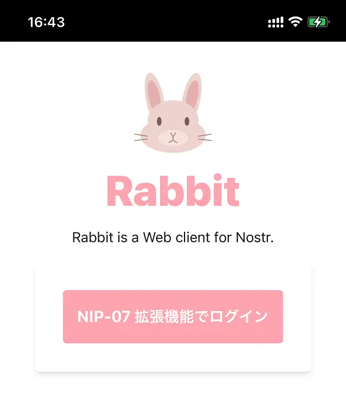

#### 投稿(署名)時
何かを投稿したりリアクションしようとしたときにも、以下のような表示が出ます。

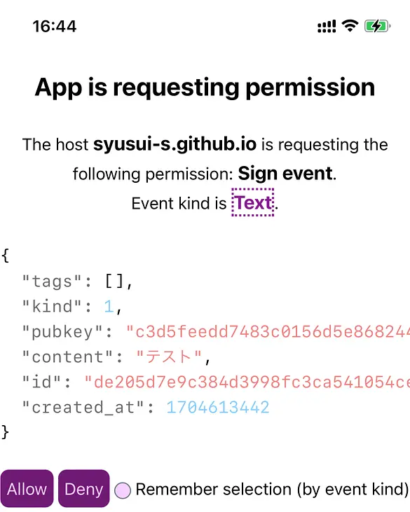

基本的に「Remember selection」(この選択を毎回使用する)をタップしてチェックを付けてから、「Allow」(許可)を選択します。

使い方は以上です。

