# PWAをインストールしよう

いくつかのWeb版 Nostr クライアントはPWA(Progressive Web Apps)と呼ばれる形で提供されており、PC・スマホアプリのようにスタートメニューやホーム画面にインストールして使用することができます。

ここでは、[nostter](../get-started/nostter.md)を例にして、iOS, Android, Windows(Micorosft Edge)の場合を例に説明します。説明がない環境でも、同様の機能が利用できるはずです。

## 1. iOS(iPhone/iPad)の場合

ブラウザでアプリのページを開き、ブラウザのメニューを開きます。

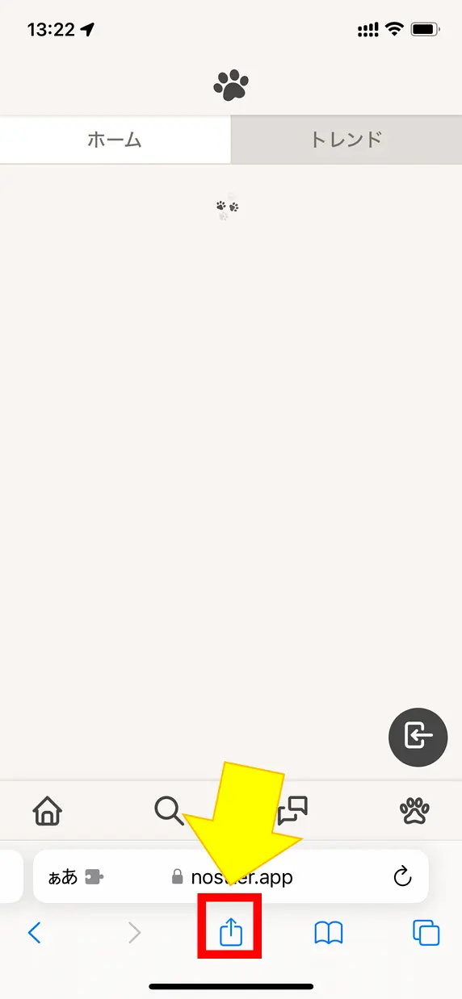

スワイプして「ホーム画面に追加」ボタンをタップします。

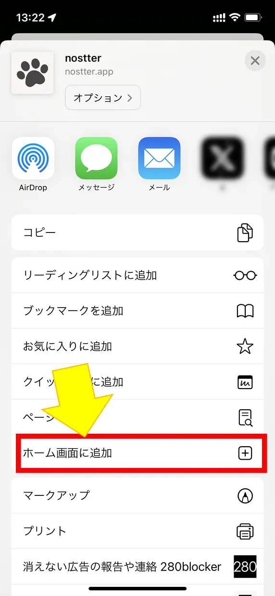

必要に応じて名前を編集し、右上の「追加」ボタンをタップします

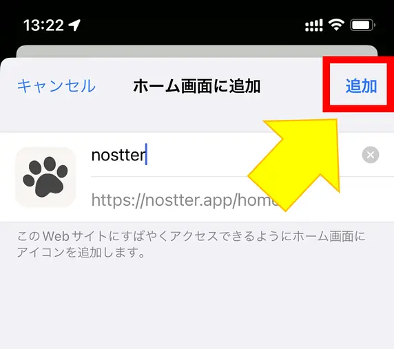

ホーム画面に追加されました。タップするとアプリとして起動します。

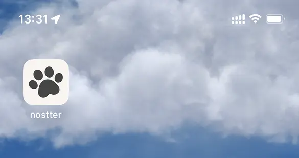

## 2. Androidの場合

ブラウザでアプリのページを開き、ブラウザのメニューを開きます。

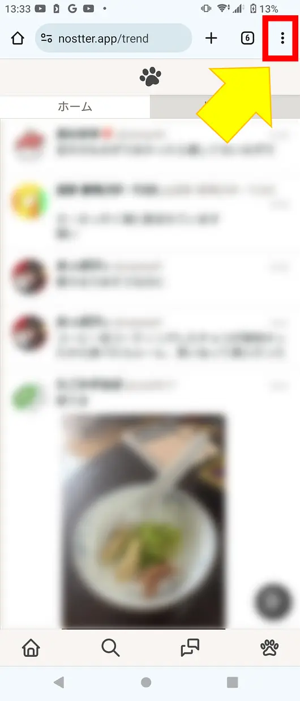

「アプリをインストール」ボタンをタップします。

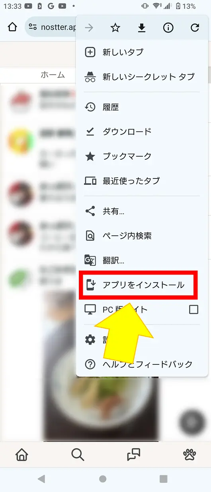

「インストール」ボタンをタップします

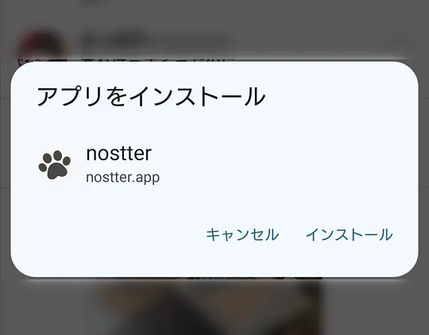

インストール完了の通知が出ればOKです。

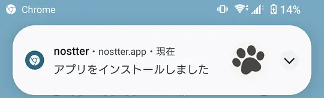

アプリに追加されました。タップするとアプリとして起動します。

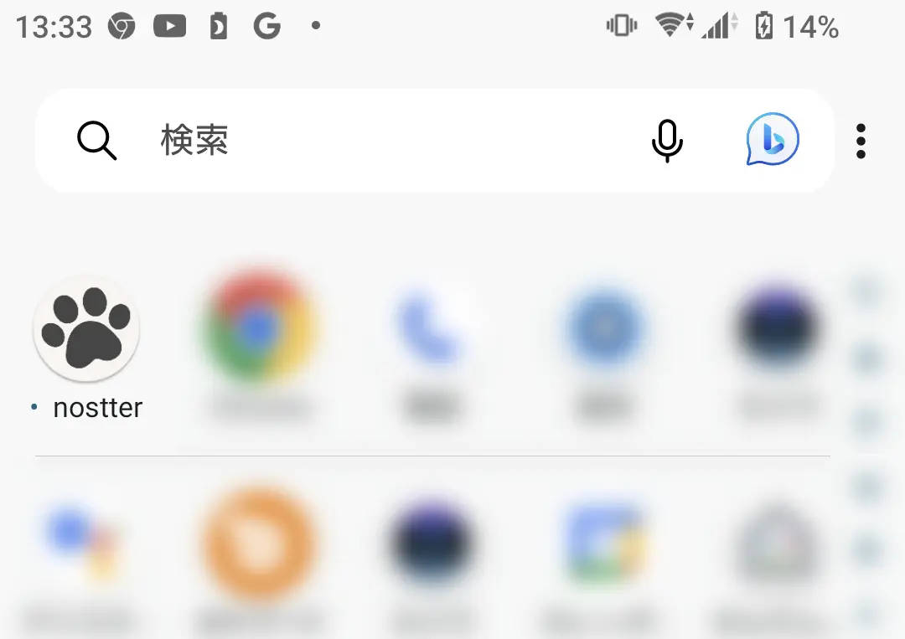

## 3. Windows(Micorosft Edge)の場合

ブラウザでアプリのページを開き、ブラウザの「アプリのインストール」ボタンをクリックします。

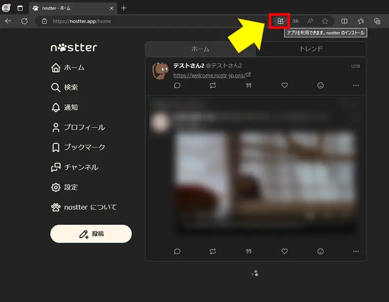

「インストール」ボタンをクリックします。

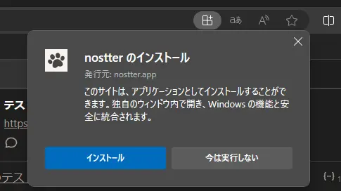

アプリが自動起動しインストール完了の通知が出たら、必要な項目にチェックを入れて「許可」をクリックします。

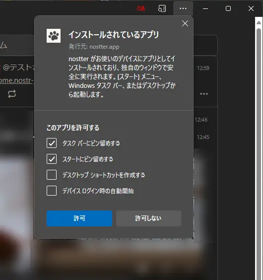

ピン留めを選択した場合、このような通知が出ますので「はい」をクリックします。

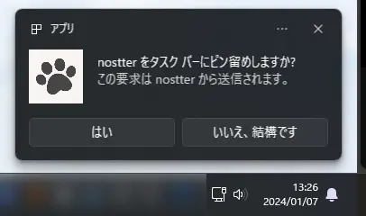

スタートメニューやタスクバーなど、指定した場所にアプリとして追加されました。
クリックするとアプリとして起動します。
